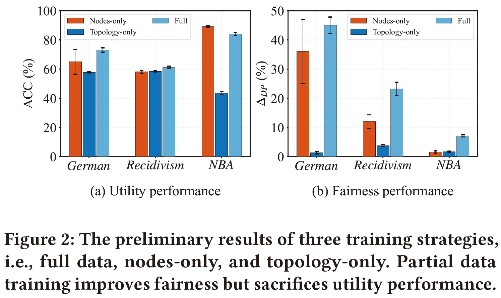
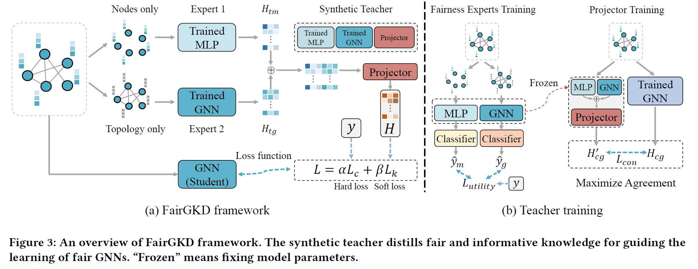

# FairGKD
A PyTorch implementation of "[The Devil is in the Data: Learning Fair Graph Neural Networks via Partial Knowledge Distillation](https://arxiv.org/abs/2311.17373)". 

## Overview
GNNs have been shown to be unfair as they tend to make discriminatory decisions toward certain demographic groups, divided by sensitive attributes such as gender and race. While recent works have been devoted to improving their fairness performance, they often require accessible demographic information. This greatly limits their applicability in real-world scenarios due to legal restrictions. To address this problem, **we present a demographic-agnostic method to learn fair GNNs via knowledge distillation, namely FairGKD**. FairGKD is motivated by our empirical observation on partial data training. 



FairGKD consists of a synthetic teacher and a GNN student model denoted by $f_{t}$ and $f_{s}$, respectively. $f_{s}$ is a GNN classifier for the node classification task, mimicking the output of $f_{t}$. The synthetic teacher $f_{t}$ aims to distill fair and informative knowledge $H$ for the student model. Specifically, $f_{t}$ is comprised of two fairness experts, $f_{tm}$ and $f_{tg}$, and a projector $f_{tp}$. Here, $f_{tm}$ and $f_{tg}$, which are trained on only node attributes and only topology, alleviate higher-level biases without requiring access to sensitive attributes. Due to partial data training, $f_{tm}$ and $f_{tg}$ may generate fair yet uninformative node representations denoted by $H_{tm}$, $H_{tg}$. To bridge this gap, the projector $f_{tp}$ is used to combine these uninformative representations and performs mapping to generate informative representation $H$. $H$ will be regarded as additional supervision to assist the learning of $f_{s}$. Mimicking fair and informative representation $H$, $f_{s}$ tends to generate fair node representation while preserving utility. 



## Requirements
- numpy==1.21.6
- torch==1.6.0
- torch-cluster==1.5.9
- torch_geometric==2.0.4
- torch-scatter==2.0.6
- torch-sparse==0.6.9
- CUDA 11.7

## Reproduction
To reproduce our results, please run:
```shell
bash run.sh
```